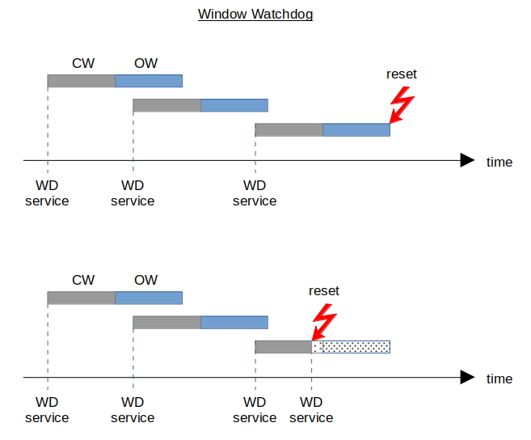

# Developing Fault-Tolerant Software for STM8S / STM8AF Microcontrollers

by Georg Icking-Konert

For feedback, bugfixes or additional tipps and tricks, please feel free to open an issue or pull request on [Github](https://github.com), or contact me directly under [icking@onlinehome.de](icking@onlinehome.de).

Happy and robust coding! :thumbsup:

---

**Disclaimer**

This guide and provided examples are provided "as is", without warranty of any kind. For details see [license file](LICENSE).

---

## Motivation / Background

Unlike personal computers, Embedded Microcontrollers (µCs) are mostly used in applications without the option of a manual or remote reset in case of a system crash. Recovery in these cases often requires manually interrupting the power supply, which may be difficult or even impossible. Typical applications for embedded devices are industrial, automotive and wearables, to name but a few.

Due to this limitation, embedded software (SW) has to ensure that the system **autonomously** detects issues like system stalls, and reacts accordingly, e.g. by resetting the system. This built-in recovery or fault tolerance, is crucial for high system availability in rugged environments.

Fault tolerance can be achieved via µC internal features (e.g. internal watchdog), µC external components (e.g. reset-IC), or even system external (e.g. supervised power supply).

This document focuses on features of the STM8S/AF µC. However, most techniques are rather general and can be adapted to other µCs as well. But as details vary between µCs, the below described techniques may need to be adapted accordingly.

## General Remarks

- As a rule of thumb, 95% of embedded SW bugs occur during power-on, wake, reset, sleep mode entry, and flash write/erase. Therefore, special care has to be taken when programming & testing these operation modes

- The "correct" reaction in case of a system crash depends on the actual safety case. While an immediate system reset is often the best choice, sometimes a "limp home" mode, or a safe shutdown may be preferrable

- Many of the below described techniques are described in STM application notes [AN1015](https://www.st.com/content/ccc/resource/technical/document/application_note/1c/6c/02/93/79/c8/4e/32/CD00004037.pdf/files/CD00004037.pdf/jcr:content/translations/en.CD00004037.pdf) and [AN4435](https://www.st.com/content/ccc/resource/technical/document/application_note/ff/a7/a7/01/7c/9f/43/d4/DM00105610.pdf/files/DM00105610.pdf/jcr:content/translations/en.DM00105610.pdf). The latter also describes a certified safety library for self-tests, which is available from the ST homepage. However, it cannot be used here due to license restrictions

---


## Table of Content

- [Developing Fault-Tolerant Software for STM8S / STM8AF Microcontrollers](#developing-fault-tolerant-software-for-stm8s--stm8af-microcontrollers)
  - [Motivation / Background](#motivation--background)
  - [General Remarks](#general-remarks)
  - [Table of Content](#table-of-content)
  - [Software Reset](#software-reset)
    - [Bad Practice](#bad-practice)
    - [Good Practice](#good-practice)
  - [External Clock](#external-clock)
    - [HSE Activation Failure](#hse-activation-failure)
    - [HSE Failure during Operation](#hse-failure-during-operation)
  - [Watchdogs](#watchdogs)
    - [General Hints](#general-hints)
    - [Independent Timeout Watchdog (IWDG)](#independent-timeout-watchdog-iwdg)
    - [Window Watchdog (WWDG)](#window-watchdog-wwdg)
  - [Option Bytes](#option-bytes)
  - [Flash Protection](#flash-protection)
    - [Properties](#properties)
    - [General Hints](#general-hints-1)
    - [Protect P-Flash](#protect-p-flash)
    - [Protect EEPROM / D-Flash](#protect-eeprom--d-flash)
  - [Bootloader](#bootloader)
    - [ROM Bootloader](#rom-bootloader)
    - [Custom Flash Bootloader](#custom-flash-bootloader)
  - [Fill Unused Flash](#fill-unused-flash)
  - [Handle Unused Interrupts](#handle-unused-interrupts)
  - [Checksum over Static Flash](#checksum-over-static-flash)
  - [RAM Check](#ram-check)
  - [Refresh Peripheral Registers](#refresh-peripheral-registers)
  - [Conclusion](#conclusion)


---


## Software Reset

Sometimes the software needs to reset the system e.g. because an irrecoverable error was detected. In general terms a SW reset is intended to **restore a well-defined system state**.


### Bad Practice

To perform a SW reset it is tempting to literally "goto" the beginning of the user program:

     void main()
     {
     Reset:
         initialize();

         while (1)
         {
             ...
             if ( error_occurred )
                 goto Reset;
             ...
         }
     }

There have been [many discussions](https://stackoverflow.com/questions/46586/goto-still-considered-harmful) about the use of "goto" commands in C/C++, but there are other, very practical reasons to avoid this kind of SW reset.

The below image shows the boot/reset sequence of the STM8:


As you can see the above SW reset skips the STM8 hardware (HW) initialization, ROM startup and flash startup altogether. These are executed after any (proper) reset and e.g. initialize core and peripheral registers, stack and global variables. In addition, the ROM startup configures some peripherals based on the [option byte](#option-bytes) (OPT) content. All this is skipped by the above SW reset. Therefore, if the reason for a system crash is e.g. a corrupted SFR content, the above SW reset may not restore full system functionality.

In summary, **SW resets via "goto" command perform only a partial system reset, and should be avoided**


### Good Practice

The STM8S/AF features 7 independent reset sources, see [reference manual](https://www.st.com/resource/en/reference_manual/rm0016-stm8s-series-and-stm8af-series-8bit-microcontrollers-stmicroelectronics.pdf) (RM), section 8:

| Reset Source                              | Description                        |
| ----------------------------------------- | ---------------------------------- |
| External reset                            | pin NRST pulled low                |
| Power-on (POR) and Brown-out reset (BOR)  | supply voltage low                 |
| Independent watchdog reset (IWDG)         | timeout watchdog (indep.clock)     |
| Window watchdog reset (WWDG)              | window watchdog reset (CPU clock)  |
| SWIM reset (SWIM)                         | reset via debug command            |
| Illegal opcode reset (IOP)                | unsupported command code           |
| EMC reset    (EMC)                        | critical register corrupt          |

Some of these resets can be triggered by SW, namely IWDG, WWDG and IOP.

The [RM](https://www.st.com/resource/en/reference_manual/rm0016-stm8s-series-and-stm8af-series-8bit-microcontrollers-stmicroelectronics.pdf) section 15.3 proposes to use trigger a SW reset via ```WWDG->CR=0x80``` like this

     void main()
     {
         init_clk();
         init_gpio();
         ...

         while (1)
         {
             ...
             if ( error_occurred )
                 WWDG->CR=0x80;
             ...
         }
     }


However, some STM8S/AF lack the WWDG window watchdog. In this case I propose to use IOP reset instead, which is (literally) a core feature of all STM8 devices. For an implementation of both methods see file [sw_reset.h](./lib/sw_reset/sw_reset.h)

The source of a reset can be read by SW after restart from SFR RST->SR (see [RM](https://www.st.com/resource/en/reference_manual/rm0016-stm8s-series-and-stm8af-series-8bit-microcontrollers-stmicroelectronics.pdf), section 8.4.1). This may be helpful to skip e.g. greeting messages after a SW reset.

In summary, **implement SW resets via WWDG or ILLOP to ensure full system reset**

**Notes:**

- Some other µCs support different reset levels, e.g. not all registers are reset by each reset source. However, STM8S/AF has only one reset level.

- Distinction of a SW reset from an actual WWDG or IOP is possible, but requires only partial RAM initialization by the application startup code. 
However, this goes beyond the scope of this document.

- Opcode 0x00 (= flash erased) is not defined according to [PM0044](https://www.st.com/content/ccc/resource/technical/document/programming_manual/43/24/13/9a/89/df/45/ed/CD00161709.pdf/files/CD00161709.pdf/jcr:content/translations/en.CD00161709.pdf), and should trigger an IOP reset. However, tests showed a spurious behavior with reset not triggered reliably. [SPL example](https://documentation.help/STM8S-STM8A/STM8S__StdPeriph__Examples_2RST_2RST__IllegalOpcode_2main_8c_source.html) instead uses opcode 0x75, which works as expected

----

**Example:** [src/sw_reset](./src/sw_reset)

[Back to Top](#table-of-content)

------------------------------------------------


## External Clock

If an external clock (HSE) is required, e.g. due to high timing requirements, there is a risk that the clock doesn't start up or fails during operation.

A robust SW has to detect a HSE failure and react accordingly. As usual the "correct" reaction depends on the actual use case. The provided [example](./src/external_clock) reverts to the internal clock (HSI) and changes the LED blinking frequency according to the failure mode.

**Notes:**

- Most other example projects are written for the [NUCLEO-8S207K8](https://www.st.com/en/evaluation-tools/nucleo-8s207k8.html) board. However, as it doesn't feature a HSE resonator, the below example is written for the [STM8S-Discovery](https://www.st.com/en/evaluation-tools/stm8s-discovery.html) board

- HSE failure can be provoked manually by shorting the resonator pins e.g. with a paper clip


### HSE Activation Failure

Switching from the default internal high-speed clock (HSI) to an external high-speed clock (HSE) is done in several steps:

     start HSE
     while (!HSE stable);
     switch to HSE
     continue...

Prior to the actual switching to HSE, the CPU keeps running on the HSI clock. A HSE start-up failure can therefore be detected by a timeout check:

     start HSE
     while ((!HSE stable) && (!Timeout));
     if (HSE stable)
         switch to HSE
     else
         error reaction, e.g. reset or continue on HSI
     continue...

**Notes:**

- If a [watchdog](#watchdogs) (WD) is used

  - It can be used instead of the above timeout check. However, a WD:

    - Can only reset the system. More sophisticated reactions like a limp-home mode using HSI, are not possible 

    - Leads to a stalled system in case of a permanently disabled HSE

  - It must be configured with a sufficiently long period, or serviced during wait for HSE stable


### HSE Failure during Operation

The STM8S/AF features a so-called clock security system (CSS), which can optionally supervise the external HSE clock via the internal HSI clock, see [reference manual](https://www.st.com/resource/en/reference_manual/rm0016-stm8s-series-and-stm8af-series-8bit-microcontrollers-stmicroelectronics.pdf) (RM), section 4.5. If the CSS is activated and detects a HSE failure, f<sub>CPU</sub> automatically falls back to HSI (with prescaler 1/8), and an optional interrupt is triggered. Inside the CSS-ISR, the SW can then e.g. trigger a [SW-reset](#software-reset) or continue operation on HSI clock.

The resulting code looks like this:

     start HSE
     while ((!HSE stable) && (!Timeout));
     if (HSE stable)
         activate CSS with interrupt
         switch to HSE
     else
         error reaction, e.g. reset or stay on HSI
     continue...

     interrupt CSS_ISR
         error reaction, e.g. reset

----

**Example:** [src/external_clock](./src/external_clock)

[Back to Top](#table-of-content)

------------------------------------------------


## Watchdogs

A common method to recover a stalled system are so-called watchdogs (WD). A WD is a SW-independent circuit, which resets the system if it is not serviced correctly by the software. As with most safety features, watchdogs are inconvenient and require additional considerations. However, generally the WD is our last line of defense to restore system functionality if all else fails.

An infamous example for a missing watchdog is the NASA Clementine mission. For reasons unknown to me, the developers  omitted an independent HW-WD, but only implemented a SW-WD instead. However, when the on-board computer stalled during the mission, the SW-WD was not executed and therefore couldn't reset the system. As a result the mission had to be aborted.  

In contrast, the later Pathfinder mission used a proper HW-WD, maybe a lesson learned from Clementine. Sure enough, the on-board stalled during the mission due to a SW bug. However, as the HW-WD reset the system as intended, a SW bugfix could be applied remotely and the mission was saved. Hooray team watchdog!

Depending on the required application robustness and safety level, different kinds of watchdogs are used. The most common WD types in embedded computing (from simple to complex) are:

- Timeout watchdog: after each service, the WD starts with an open window (OW) of a given time duration. If the next service is not performed within the OW, the system is reset. SW can service arbitrarily frequent. Too rare service resets the system


- Window watchdog: after each service, the WD starts with a closed window (CW), followed by an open window (OW).  If the next service is not performed within the OW, the system is reset. Too frequent or too rare services reset the system


- Challenge-response watchdog: used in safety-critical applications. The WD “asks” the application SW a question at fixed or random intervals, e.g. what is sqrt(16), and resets the system if no correct answer is received within a given time

The STM8S/AF, being a humble 8-bit µC, features “only” the first two watchdogs, called Independent Timeout Watchdog (IWDG), and Window Watchdog (WWDG). Both have strengths and weaknesses, so for optimum robustness both should be used. However, any decent real-word SW should at least use the IWDG. 


### General Hints

- If you need high availability, but your system architecture does not allow using an independent hardware watchdog, change the architecture, do not omit the watchdog!

- Start WDs as early as possible, as this minimizes the time during which your application is unprotected. Generally WDs are activated at the start of the initialization, or even automatically via [option bytes](#option-bytes)
  
- Service watchdogs only once before initialization, and then periodically within the main loop. This ensures that the main loop is executed periodically, and keeps the WD SW-design simple (=good)
  
- Do not service watchdogs all over the program, especially in sub-routines. Exceptions may be blocking operations which take longer than the WD timout period - however these should be avoided, or at least kept at a minimum! In this case keep the exit condition "dumb", i.e. don't rely e.g. on SW clock via interrupts, but rather on a simple counter

- Never service the WDs within a timer interrupt service routine (ISR). While this may be convenient for the developer, it greatly reduces the WD effectiveness. For example, if the SW is stuck in an endless loop, the timer ISR is still executed and the WD is still serviced.

- Never service the WDs while waiting for a HW state, e.g. wait for flash ready or wait for ADC conversion ready. Else the SW effectively stalls if the target state is not reached for whatever reason 

- When using a watchdog, it is crucial to know the timing of your software, namely the min/max execution time of the main loop and all called functions. Of course - but often forgotten - timing has to be re-checked after each (relevant) SW change

- Do not use a sub-routine to service watchdogs, but directly access registers in `main()`. Therefore, below examples omit use of the [STM8S/AF Standard Peripheral Library (SPL)](https://www.st.com/en/embedded-software/stsw-stm8069.html) helper functions, but rely only on macros and inline functions. This ensures a zero call depth for WD services.

- If the WD uses a separate clock, like the [IWDG](#independent-timeout-watchdog-iwdg), take into account the clock mismatch between f<sub>CPU</sub> and f<sub>WD</sub>

- Both STM8 watchdogs reset without pre-warning. As this may happen at any time, try to design your system such that a µC reset doesn't cause damage. If that is not possible:
  
  - Implement an *additional* SW watchdog via HW timer interrupt. In the ISR shut down the system safely
  
  - Do not try to recover the system in the ISR, as it should never be called in the first place. Instead enter an endless loop and wait for the WD reset, or perform a [SW reset](#software-reset)

  - Configure the timer period shorter than the WD service period. Reset the timer counter at the "same time" as the WD service

  That way, as long as SW is still functional you can shut down the system prior to a system reset. Only if SW is stalled completely, the WD resets the system without prior shutdown as a last resort  

In the simplest implementation, a timeout WD is configured once during initialization and then serviced every main loop execution. This already covers most error cases, as it ensures that the *main loop is executed once during the timeout period*. Or so you would think...

Because actually this strategy only ensures that the *part of the main loop which contains the WD service is at least executed once during the timeout period*. For example, an endless loop which just executes that part of the main loop would not trigger a reset. While this might look like hair-splitting, please remember that the WD only kicks in when your nice system behavior breaks down. **When designing your WD concept, forget SW flow-charts. Instead assume that anything can happen anytime - be paranoid!** 

For a slighly more sophisticated WD strategy see the [IWDG](#independent-timeout-watchdog-iwdg) and [WWDG](#window-watchdog-wwdg) examples. Additional tricks to enhance WD protection can be found e.g. [here](http://www.ganssle.com/watchdogs.htm). But remember, there is no optimum watchdog strategy which fits every application. Instead, a good watchdog strategy depends heavily on the required safety level and/or error reaction time of your application.

**In summary, watchdogs are inconvenient for SW developers, as they require a timing analysis and matching WD-strategy. However, they are our last line of defense if all else fails!**


### Independent Timeout Watchdog (IWDG) ##

The independent timeout watchdog (IWDG) of the STM8S/AF is described in the [reference manual](https://www.st.com/resource/en/reference_manual/rm0016-stm8s-series-and-stm8af-series-8bit-microcontrollers-stmicroelectronics.pdf) (RM) section 14.

**Properties:**

  - IWDG runs on a 128kHz clock (LSI), which is independent from the CPU clock (hence the name)

  - LSI clock frequency has an error of up to +/-15%, see e.g. [STM8S207K8 datasheet](https://www.st.com/resource/en/datasheet/stm8s207k8.pdf), table 34. The mismatch between CPU and LSI clock has to be accounted for when setting the timeout period

  - LSI frequency can be measured using f<sub>CPU</sub> for tighter timing (see [SPL](https://www.st.com/en/embedded-software/stsw-stm8069.html) IWDG example). In this case re-measure periodically to account for slow LSI frequency drift

  - Once started, the IWDG cannot be stopped by user SW until next reset

  - Timeout period can be configured by SW between 64µs and 1s (typ.). Configuration registers are "password protected"

  - Optional activation by boot-ROM via [option bytes](#option-bytes), see e.g. [STM8S207K8 datasheet](https://www.st.com/resource/en/datasheet/stm8s207k8.pdf), section 8. Default timeout after reset is 16ms

For a "normal" (i.e. not safety critical) software I generally configure the timeout period to 2x the longest main loop execution time. This covers the clock mismatch between CPU and LSI clocks, and still provides some buffer for timing deviations.

The IWDG example demonstrates a slightly improved concept compared to the most simple one, described above (*service IWDG once per main loop*). Essentially it adds a small state machine, which ensures that IWDG is only serviced after each sub-routine has been executed exactly once. The remaining weak lines are the actual IWDG service at the end of the main loop, and the line where the final state value is set within *test_4()*.

This is only to show that a small change to your WD concept can significantly improve the effective protection. Of course this only works for strictly linear program flow, with each sub-routine being executed exactly once per main loop execution. More realistic scenarios with scheduled tasks etc. require a more sophisticated scheme - but you get the idea...

----

**Example:** [src/iwdg_watchdog](./src/iwdg_watchdog)

[Back to Top](#table-of-content)

----


### Window Watchdog (WWDG) ##

The window watchdog (WWDG) of the STM8S/AF is described in the [reference manual](https://www.st.com/resource/en/reference_manual/rm0016-stm8s-series-and-stm8af-series-8bit-microcontrollers-stmicroelectronics.pdf) (RM) section 15.

**Properties:**

  - WWDG runs on the CPU clock. This allows a much tighter timing than IWDG, but is not "independent"

  - Once started, the WWDG cannot be stopped by user SW until next reset

  - Timeout period and closed window and can be configured individually by SW between 768µs and 49.2ms @ 16MHz

  - Optional activation by boot-ROM via [option bytes](#option-bytes), see e.g. [STM8S207K8 datasheet](https://www.st.com/resource/en/datasheet/stm8s207k8.pdf), section 8. Default after reset is 49.2ms timeout and no closed window

  - By setting the closed window to maximum, WWDG can be configured as a timeout watchdog. This is more convenient but less safe 

  - The WWGD is the proposed method by STM to force an immediate reset, see [Software Reset](#software-reset)

As mentioned above, the WWDG runs on the CPU clock. Thus, a failure of the CPU clock effectively disables WWDG. Therefore IMHO WWDG is optional, while IWDG is mandatory. But the decision is all yours...

However, WWDG being a window watchdog with no clock mismatch to the application allows a *much* tighter assertion of max. <u>and</u> min. execution times. In addition WWDG allows a much faster error reaction time than IWDG.

Instead of simply replicating the IWDG example with WWDG, the below example adds a new functionality, which can easily be combined with the above IWDG example. Basically it asserts that *each called sub-routine has the expected execution time*. A failure results in a system reset.

As WWDG configuration registers are not password protected, they can easily be modified during run-time - as shown in below example. **When configuring WWDG timing, also consider max. ISR execution times**, as these may interrupt the linear program flow at any time. Alternatively disable interrupts for safety- and time-critical function calls.  

----

**Example:** [src/wwdg_watchdog](./src/wwdg_watchdog)

[Back to Top](#table-of-content)

------------------------------------------------


## Option Bytes

Option bytes allow to modify some STM8 configurations after power-on and/or reset, like [ROM-bootloader](#rom-bootloader) activation or re-mapping or GPIOs. In other µCs they are often called "fuse bits". 

**Properties:**

- Option bytes are stored in a dedicated block of the flash memory. For details see the device datasheet, see e.g. [STM8S207K8](https://www.st.com/resource/en/datasheet/stm8s207k8.pdf), chapter 8.   

- Most option bytes OPTx must be stored together with their binary complement NOPTx. **A mismatch (OPTx != NOPTx^0xFF) leads to an immediate reset**

- All option bytes can be modified via SWIM debug interface SWIM. In application mode, all option bytes except read-out-protection (ROP) can also be modified

For details on how to modify option bytes "on the fly" by the application SW refer to the STM8 Programming manual [PM0051](https://www.st.com/content/ccc/resource/technical/document/programming_manual/0f/82/71/32/87/2a/46/f2/CD00191343.pdf/files/CD00191343.pdf/jcr:content/translations/en.CD00191343.pdf). However, if not absolutely required **it is strongly advised to program option bytes only in a stable factory environment via SWIM**. The reason is the above remark that a mismatch between OPTx and NOPTx leads to a reset. Thus, a disturbed write of any OPTx/NOPTx leads to a bricked device!

----

**Example:** None

[Back to Top](#table-of-content)

------------------------------------------------


## Flash Protection

The STM8 non-volatile memory (NVM) consists of three different blocks, namely application memory/P-flash, EEPROM/D-flash and Option Bytes. Option Bytes require special care and are discussed [separately](#option-bytes).


### Properties

- Both P-flash and EEPROM are secured by an [Hamming Error Correction Code](https://en.wikipedia.org/wiki/Hamming_code) (ECC) which

  - ECC width is [32bit with 6 additional ECC bits](http://www.emcu.it/STM8/STM-STM8.pdf). This (only) allows the correction of single bit errors

  - Information about an ECC correction is not available to the application SW. Essentially ECC "only" makes the STM8 flash very reliable

- Flash retention and endurance, see e.g. cover page of [STM8S207K8](https://www.st.com/resource/en/datasheet/stm8s207k8.pdf) or [STM8S005K6](https://www.st.com/resource/en/datasheet/stm8s005k6.pdf)  datasheet

  - Retention of P-flash is 20 years after 10kCycles or 100 cycles, depending on device 

  - Endurance of EEPROM is 300kCycles. Retention is not given, but typical values are 2-4 years after max. cycles and without refresh

- Flash write/erase sizes and times, see e.g [STM8S207K8 datasheet](https://www.st.com/resource/en/datasheet/stm8s207k8.pdf) table 36

  - Write unit is 1B (byte), 4B (word) or 64B/128B (block, depending on device)

  - Flash is automatically erased prior to write. An optional "fast block programming" is also available, which skips the erase before write

  - Erase unit is 64B/128B (block, depending on device). It is only required prior to fast block programming

  - Due to 4B ECC width (see above), writing 1B actually updates 4B in background. **This has to be accounted for in the enducance assessment**

  - A normal write takes ~6ms, independent of unit size. Fast block programming and erase each take ~3ms

- Memory Access Security System (MASS), see [reference manual](https://www.st.com/resource/en/reference_manual/rm0016-stm8s-series-and-stm8af-series-8bit-microcontrollers-stmicroelectronics.pdf) section 4.5.2.

  - After reset the flash blocks are individually protected against accidental write/erase by "secret" keys

  - Prior to write/erase (w/e), the SW has to unlock the respective flash by writing the correct key to the correct unlock register

  - P-flash and EEPROM have different unlock registers and unlock keys

  - After a failed unlock, the respective memory remains locked until next reset

- User Boot Code (UBC), see [reference manual](https://www.st.com/resource/en/reference_manual/rm0016-stm8s-series-and-stm8af-series-8bit-microcontrollers-stmicroelectronics.pdf) section 4.4.3

  - Flash pages of can be configured as UBC via [Option Bytes](#option-bytes) in steps of 64B or 512B (device dependent), starting from the boot address

  - Flash configured as UBC is write protected and cannot be unlocked using MASS keys. This protects the interrupt vector table and boot code (e.g. custom [bootloader](#bootloader)) against accidental erase or overwrite

- Read-Out Protection (ROP), see [reference manual](https://www.st.com/resource/en/reference_manual/rm0016-stm8s-series-and-stm8af-series-8bit-microcontrollers-stmicroelectronics.pdf) section 4.5.1

  - ROP effectively disables the debug interface and limits the in-application write/erase access, see [reference manual](https://www.st.com/resource/en/reference_manual/rm0016-stm8s-series-and-stm8af-series-8bit-microcontrollers-stmicroelectronics.pdf) table 6

  - ROP can be activated and deactivated via SWIM debug interface by writing the respective [Option Bytes](#option-bytes). A ROP deactivation triggers a complete flash mass erase, including UBC and EEPROM

  - STM8 ROP can be [bypassed](https://itooktheredpill.irgendwo.org/2020/stm8-readout-protection/) rather easily by glitching the logic supply with correct timing


### General Hints

In my experience the main risks for flash data corruption are:

- Flash cells worn out by too many w/e cycles

- Interrupted w/e operation e.g. due to unexpected power cuts

- Unintentional w/e, e.g. due to code runaway under EMC

The general precautions to minimize these risks are:

- Assess the number of w/e cycles for your application and check versus specified flash endurance

- Distribute w/e operations over many cells, e.g. instead of writing always to the same address use complete EEPROM with round-robin pattern 
  
- Minimize flash w/e time as much as possible. For example for writing 128B of data use block write (6ms) instead of 128 individual 1B writes (~0.7s)

- After write or erase, immediately lock respective flash again to minimize the unprotected time

- Detect flash corruption e.g. via checksum over dynamic data and [P-flash](#checksum-over-static-flash)

- Assert stable supply during flash w/e operations. For example, use a decoupled buffer capacitor and measure capacitor voltage prior to each flash write/erase

On top of these general precautions, and depending on the application requirements, additional measures can be implemented to protect STM8 flash against accidental data corruption. As usual, there is no optimum solution for all applications. Instead, suitable measures depend on details like option to re-flash in the field, analyzing field returns, etc.. The below hints are just options.


### Protect P-Flash

If the P-flash is not modified during normal operation, additional measures against data corruption are: 

- During initialization, write incorrect keys to register `FLASH_PUKR`. This locks the P-flash until next reset. This is a temporary measure only and has no impact on SW updates via [bootloader](#bootloader)

- Don't store P-flash unprotection key in the application SW. What's not there cannot be (ab)used unintentionally

- If a [flash bootloader](#flash-bootloader) is implemented, it should be protected by configuring the respective flash range as user boot code (UBC) via option bytes. Protecting the complete P-flash as UBC should only be done if SW updates are definitely excluded. Else it would require on-the-fly modification of [option bytes](#option-bytes), which is not advised 

- Activation of the read-out protection (see above) via [option bytes](#option-bytes) is only recommended as a measure against reverse engineering, not data security. While this increases security, it makes software updates and analysis of failed parts much more difficult
 
In a "normal", i.e. safety uncritical situation, I generally only use the first two option. IMHO the extra protection by UBC and ROP is not worth the added complexity. 


### Protect EEPROM / D-Flash

If the EEPROM is not modified during normal operation, additional measures against data corruption are: 

- During initialization, write incorrect keys to register `FLASH_DUKR`. This locks the EEPROM until next reset

- Don't store EEPROM unprotection key in the application SW. What's not there cannot be (ab)used unintentionally
 
Most applications require writing data to EEPROM during run-time. In this case the [general measures](general-hints-1) described above are even more important. 

----

**Example:** TODO

[Back to Top](#table-of-content)

------------------------------------------------


## Bootloader

Often it is beneficial to support firmware (FW) updates via a serial communication interface instead of the SWIM debug interface. Reasons for this can be

- No access to the SWIM interface in the application setup

- Simple FW update by the end user without debugger

- FW update "over the air" via the superior control unit

- You name it...

Of course the *safest* option is to omit a bootloader altogether. However, a FW update may still be required in the field. In this case you have to ensure that the bootloader is not accidentally enabled, as that can cause all kinds of damage. 


### ROM Bootloader

Most STM8 devices feature a ROM bootloader (BL), which allows to re-program flash via UART, SPI or CAN interfaces (see [UM0560](https://www.st.com/resource/en/user_manual/um0560-stm8-bootloader-stmicroelectronics.pdf) bootloader manual). While the ROM-BL may be very useful during development and production, it should be disabled via [Option Bytes](#option-bytes) prior to normal operation.

Re-enabling the ROM-BL via SW should require highly specific conditions like a short time-window after reset and/or a keyphrase via the respective communication interface. This ensures that the BL is not enabled accidentally. 

**Notes:**

- Several PC tools for software update via serial interface are available, e.g.

  - [Flash Loader Demonstrator](http://www.st.com/content/st_com/en/products/development-tools/software-development-tools/stm8-software-development-tools/stm8-programmers/flasher-stm8.html)  (UM0462) by STM: proprietary, Windows only

  - [stm8gal](https://github.com/gicking/stm8gal) by the author: open-source, Windows & Linux/Posix

  - [stm8flasher](http://sourceforge.net/p/oggstreamer/stm8flasher) by ottinger: open-source, Windows & Linux

  - [stm-serial-flasher](https://github.com/Gamadril/stm-serial-flasher) by gamadril: open-source, Chrome

- Depending on STM8 variant and UART, the ROM-BL uses either full-duplex or half-duplex (aka "reply") mode. The latter is required for SW updates via single-wire interfaces like LIN or ISO9141/K-line 


### Custom Flash Bootloader

For STM8 devices without ROM-BL, to implement missing BL functionality, or for legacy reasons a custom flash-BL may be desirable. A simple example of a custom BL can be found [here](https://github.com/lujji/stm8-bootloader). However, developing a reliable BL concept and software is beyond the scope of this document.

If not already done for [P-flash protection](#flash-protection), the flash-BL should be protected against accidental overwriting by declaring it as user boot code via [Option Bytes](#option-bytes)

While a flash-BL may be very useful during development and production, it should be disabled prior to normal operation.

Re-enabling the flash-BL via SW should require highly specific conditions like a short time-window after reset and/or a keyphrase via the respective communication interface. This ensures that the BL is not enabled accidentally. 

----

**Example:** TODO

[Back to Top](#table-of-content)

------------------------------------------------


## Fill Unused Flash

While SW has a general tendency to only grow in size, it is unlikely that your application SW fills the complete P-flash. Therefore some P-flash will likely remain unused. Specifically there will be address ranges which do not contain useful code or data. 

In case of a code runaway, e.g. due to EMC, the program counter (PC) may jump to this unused area and execute whatever "code" it happens to find there. To achieve a reproducible behavior in case of such an event, all unused P-flash can be filled with either an illegal opcode, or the opcode for TRAP (=0x83). The first triggers an immediate IOP reset. The latter calls the `trap()` function and may be used to implement e.g. a limp home mode or shut down the system safely.

As for illegal opcode: the erased flash state of STM8 is 0x00. As this is undefined according to [PM0044](https://www.st.com/content/ccc/resource/technical/document/programming_manual/43/24/13/9a/89/df/45/ed/CD00161709.pdf/files/CD00161709.pdf/jcr:content/translations/en.CD00161709.pdf), it should trigger an illegal opcode (IOP) reset. However, tests have shown a spurious behavior for 0x00 with reset not triggered reliably. The [SPL example](https://documentation.help/STM8S-STM8A/STM8S__StdPeriph__Examples_2RST_2RST__IllegalOpcode_2main_8c_source.html) by [STM](https://st.com) uses opcode 0x75, which works as expected.

In summary: to handle unexpected code runaway fill unused P-flash with
- 0x75 for immediate reset
- 0x83 for more sophisticated reaction inside `trap()` SW interrupt handler 

**Note:** filling unused flash is generally achieved via post-build actions and depends on the used toolchain

----

**Example:** None

[Back to Top](#table-of-content)

------------------------------------------------


## Handle Unused Interrupts

Likely the STM8 has more interrupt sources than are used by your application. Therefore some interrupt service routines (ISR) should never be called during runtime, and are therefore often not even implemented.

However, an interrupt may trigger unexpectedly, e.g. due to EMC disturbances. In this case the program counter (PC) jumps to the address stored at the corresponding location in the (fixed) interrupt vector table (IVT). If the respective ISR is not implemented, the jump address is undefined, which can lead to an unpredictable behaviour.

To avoid this, **all ISRs should be implemented**, even if they are not used by the application. At the very least all ISRs should be implemented as dummy functions in order to get a defined behavior (=ignore event).  

The reaction inside the unused ISRs depends on the "correct" response to an unexpected interrupt in your application, e.g.

- Do nothing, just return 

- Trigger a [SW reset](#software-reset)

- Safely shut down the system, then reset

- You name it...

**Note:** as interrupt bugs are generally difficult to find, it is often helpful to set breakpoints inside unhandled ISR functions during the development phase.  

----

**Example:** [src/unused_ISR](./src/unused_ISR)

[Back to Top](#table-of-content)

------------------------------------------------


## Checksum over Static Flash

The static part of P-flash generally contains an optional custom bootloader, the actual application code and possibly some static parameters. The integrity of this memory is crucial for a well-defined system behavior and should therefore be checked. 

The most common procedure for checking the integrity of static P-flash is as follows:

- During factory programming the application SW, optional flash bootloader and static parameters are programmed. In addition, a checksum is stored at a fixed address in flash

- The application software calculates the checksum over the corresponding address range and compares the result to the stored checksum

- In case of a mismatch, an error response can be executed. This may be a reset, reduced functionality and/or an information to the superior control unit. As always, the "correct" error reaction depends on the respective application

In a "normal", i.e. safety uncritical situation, I generally use a simple 16-bit XOR checksum over the static P-flash. Together with the [flash-ECC](#flash-protection) that should cover most error cases. However, for a more sophisticated CRC checksum implementation for STM8 see e.g. [here](https://github.com/basilhussain/stm8-crc).

**Notes:**

- As the content of flash cells may drift over time, P-flash should be checked continuously in background, not only during initialization

- As flash content is preserved over reset and power-on, a simple reset generally does not restore full system functionality 
  
- Independent checksum calculation by the PC is generally achieved via post-build actions and depends on the used toolchain

----

**Example:** TODO

[Back to Top](#table-of-content)

------------------------------------------------


## RAM Check

The random access memory (RAM) is the volatile working memory of a µC. RAM is generally cleared by the flash start-up code after each power-on or reset. The functionality of RAM is crucial for a well-defined system behavior and should therefore be checked. However, as RAM content changes continuously (and fast) during run-time, it can only be checked immediately after reset, not during run-time. 

The most common procedure for checking RAM functionality is as follows:

- During flash start-up
   
  - Fill complete RAM with a checkerboard pattern `0xA5`, and read back

  - Repeat procedure with inverted value `0x5A`

- In case of a mismatch, an error response can be executed. Most often this is a [SW reset](#software-reset), but more sophisticated reactions are possible. But remember, a µC with broken RAM cannot be trusted

**Notes:**

- More complex test patterns are described in Application Note [AN4435](https://www.st.com/content/ccc/resource/technical/document/application_note/ff/a7/a7/01/7c/9f/43/d4/DM00105610.pdf/files/DM00105610.pdf/jcr:content/translations/en.DM00105610.pdf)
  
- As the stack is reserved before jumping to `main()`, the RAM should be checked during [start-up](#software-reset)   

- Complete RAM is overwritten by the test. Therefore only CPU and SFR registers may be used for the test. This level of control generally requires to write the RAM test in assmbler
  
- Implementation of flash start-up code is heavily dependent on the used toolchain

In a "normal", i.e. safety uncritical situation, I generally don't perform a RAM check. The STM8 is produced in a robust 180nm technology, which makes spontaneous RAM bit flips unlikely. 

----

**Example:** TODO

[Back to Top](#table-of-content)

------------------------------------------------


## Refresh Peripheral Registers

Special function registers (SFR) control the behavior of all peripherals like timers, pins, but also of internal blocks like clock control and watchdogs. Therefore, corruption of a SFR e.g. by EMC can lead to unpredictable system behavior. 

To avoid data corruption of SFRs a good measure is to check and/or refresh at least the critical SFRs periodically. More details on this are given in Application Note [AN1015](https://www.st.com/content/ccc/resource/technical/document/application_note/1c/6c/02/93/79/c8/4e/32/CD00004037.pdf/files/CD00004037.pdf/jcr:content/translations/en.CD00004037.pdf)

**Notes:**

- Modern µCs have *many* SFR registers. Most of which are likely uncritical for your application. However, a careful assessment of critical SFRs for check/refresh is required 

- Some SFRs require special care and cannot be refreshed at any arbitrary time. For example the UART baudrate registers must be written in a fixed order.  
  
- Depending on system requirements it may be *cleaner* (and certainly easier) to trigger a [SW reset](#software-reset) if a SFR does not have the expected value

In a "normal", i.e. safety uncritical situation, I generally don't refresh SFRs periodically. The STM8 is produced in a robust 180nm technology, which makes spontaneous SFR corruption unlikely. 

----

**Example:** TODO

[Back to Top](#table-of-content)

------------------------------------------------


## Conclusion 

This text describes some basic techniques to develop fault-tolerant embedded software for the STM8 microcontroller. While most methods are specific, most are readily adaptable to other µCs. However, other chips offer other HW features, which have to be assessed carefully. Examples:

- Multiple reset levels with different effects on SFRs

- More ECC bits for 1-/2-bit error distinction with SW access to ECC result
  
- Fault collection unit (FCU) for 

- Watchdog with pre-warning interrupt for safe system shutdown

- ...

Anyway, the take home message of this text should not be a step-by-step instruction for SW developers, but rather a call to leave the comfort zone of SW architectures and flowcharts and also consider possible system deviations and failures. 

Now let's go and develop fault-tolerant embedded software! :thumbsup:

----

**Example:** TODO

[Back to Top](#table-of-content)
